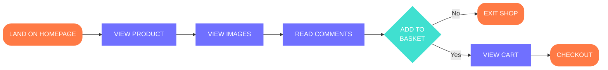

# Health-Camp

# Tech Stack

- **Frontend Stack**
  - CSS
  - HTML
  - JavaScript
  - React
  - Vite
- **Backend Stack**
  - Node.js
  - Fastify
- **Database Stack**
  - MYSQL
- **ORM Stack**
  - Prisma ORM
- **Deployment & Tools**
  - Docker
  - GitHub
  - Visual Studio Code

# User Roles

The application supports the following user roles:

- **Admin** - Full system access
- **Volunteer** - Manages patient flow, doctor assignments, camp operations, Register patients and records vitals
- **Patient** - Patient related data access
- **Doctor** - Doctor related data access

# User Features and Work Flow

## 1. Patient

**Features :**

- View Personal details, Doctor Assignment, medical reports, vitals and prescription
- Download medical report history
- Track visit dates and folow-ups

**Work Flow :**
[Patient Registration] -> [check vital signs] -> [Consult Doctor] -> [ Diagnosis Test] -> [Consult Doctor] -> [Prescription]

## 2. Volunteer

**Features :**

- create, view and update patient registration profiles
- Assign a patient to specific doctor
- Track medical report history and update vital signs
- View test reports, prescription reports, medicine details and follow-ups

## 3. Doctor

**Features :**

- View and update doctor's Personal details
- view assigned Patient details, medical history, test reports
- Create, view and upadte presription reports and medication dosage
- view available Medical camp inventory

## 4. Admin

**Features :**

- Provide authorization based on user role
- CRUD Operations on Doctors, Volunteers and Patients
- Create medical camps, manage camp locations, activities and monitor camp operations, assign staff
- Check, monitor and genarate patient records, registration, consultations and follow-up visits
- Track inventory
- View and genarate Prescription reports

